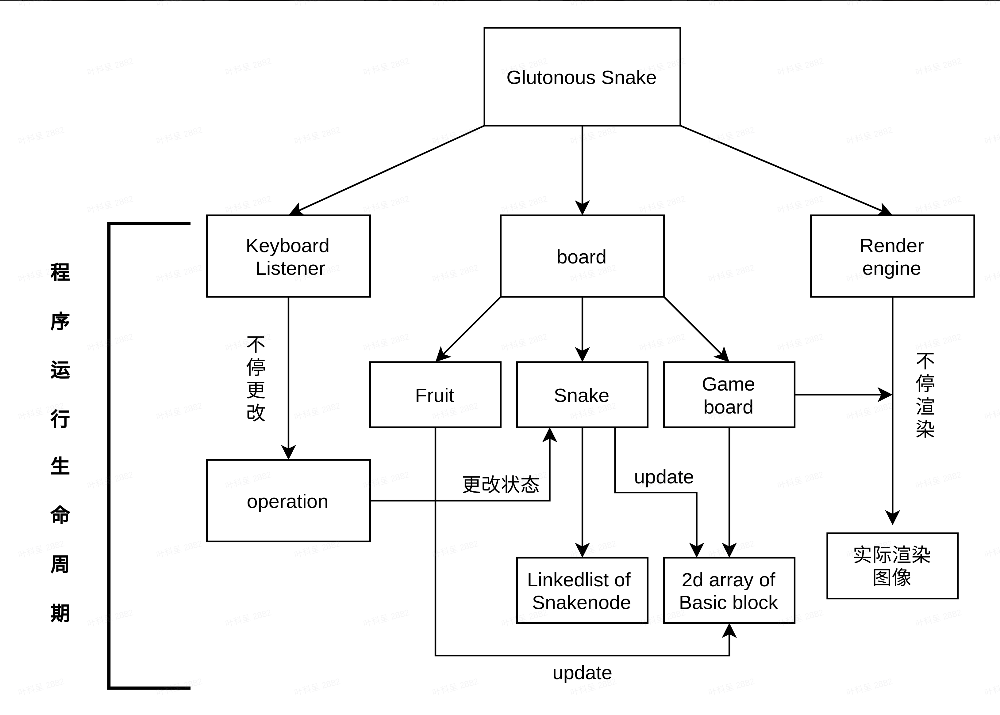

# Glutonous Snake

### Python 环境设置
```{bash}
pip install -r requirements.txt
```

### 整个项目的流程


### [阶段一任务](phase/phase_1.md)

### [阶段二任务](phase/phase_2.md)

### [阶段三任务](phase/phase_3.md)

### [阶段四任务](phase/phase_4.md)

### [阶段五任务](phase/phase_5.md)

### [阶段六任务](phase/phase_6.md)

### [阶段七任务](phase/phase_7.md)

### [阶段八任务](phase/phase_8.md)

### [阶段九任务](phase/phase_9.md)

### [阶段十任务](phase/phase_10.md)

